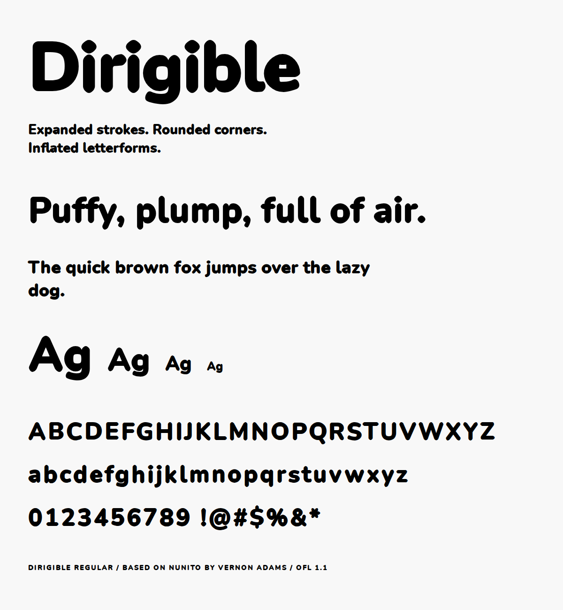

# Dirigible



Dirigible is a display typeface based on [Nunito](https://github.com/googlefonts/nunito) by Vernon Adams. Every contour has been pushed outward and all corners rounded as far as they go, so the letters look inflated. Single weight, Regular only.

## Building

Fonts are built using [gftools](https://github.com/googlefonts/gftools).

Install dependencies:

```
pip install -r requirements.txt
```

Build:

```
cd sources
gftools builder config.yaml
```

## License

Dirigible is licensed under the [SIL Open Font License, Version 1.1](OFL.txt).

Nunito was originally designed by Vernon Adams. Dirigible is a derivative work by Michael Seh.
